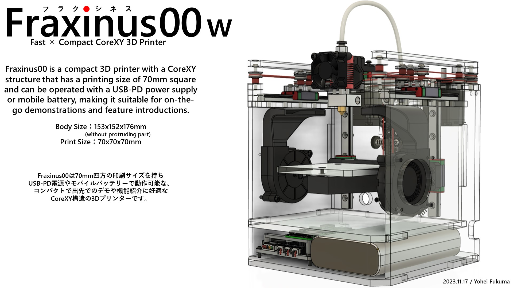
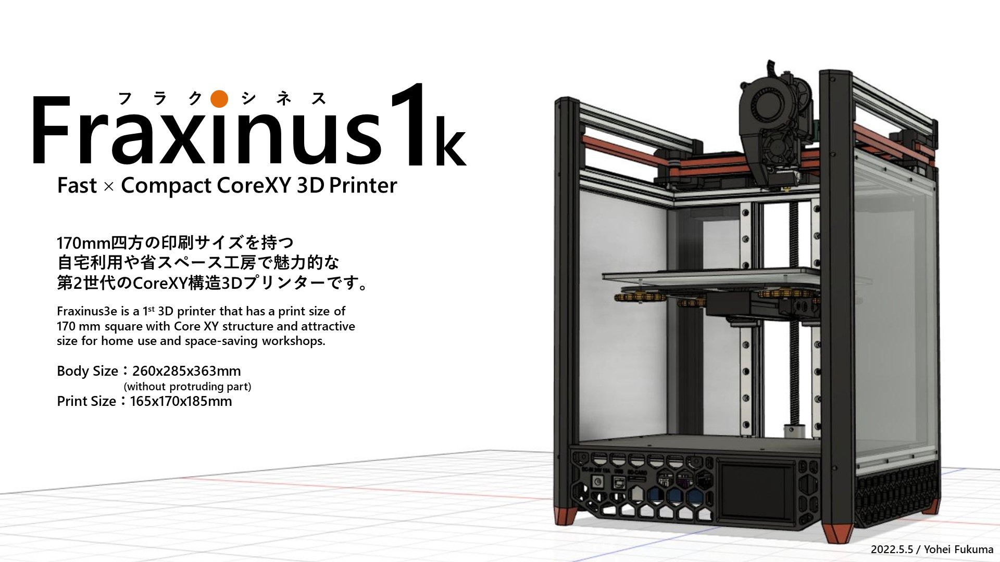
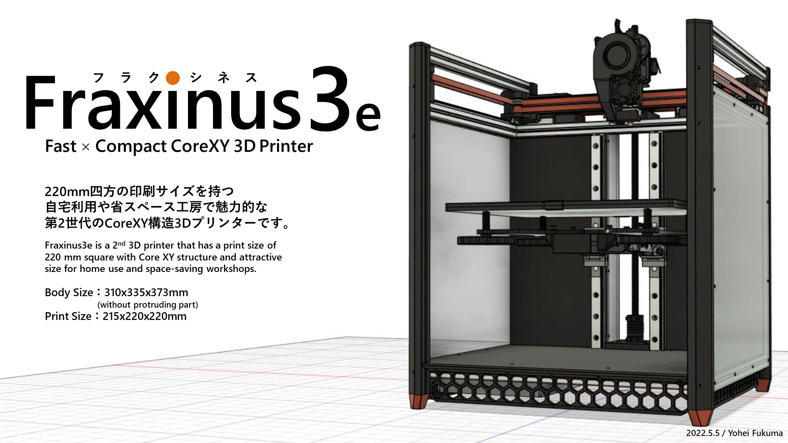
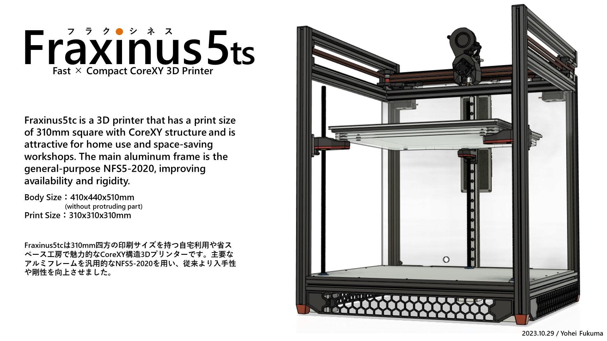

# Fraxinus

CoreXY構造を採用したコンパクト3Dプリンター「Fraxinus（フラクシネス）」プロジェクトのウェブサイト

2024年11月現在印刷サイズは70mm角、170mm角、220mm角、310mm角、510mm角の5種を展開しています。

## License

(C) 2022-2025 Fraxinus Project

`static/images`および`content`フォルダ内のファイルは[CC BY-NC-SA 4.0](https://github.com/Fraxinus-3D/docs/blob/main/LICENSE.md#CC-BY-NC-SA)（[日本語](https://creativecommons.org/licenses/by-nc-sa/4.0/legalcode.ja)）で公開されています。

その他のファイルは[MITライセンス](https://github.com/Fraxinus-3D/docs/blob/main/LICENSE.md#MIT)（[日本語](https://licenses.opensource.jp/MIT/MIT.html)）で公開されています。

## Acknowledgements

The following resources are included/used in the theme:

- [Minimo](https://github.com/MunifTanjim/minimo) by Munif Tanjim - Licensed under the [MIT License](https://github.com/MunifTanjim/minimo/blob/e6bf20b9751ec7c5ea60aa4d9ca79529465aeee9/LICENSE).
- [Feather](https://feather.netlify.com/) by Cole Bemis - Licensed under the [MIT License](https://github.com/colebemis/feather/blob/f81cd40fdcdd5e94f3f97eb670a5058e3aac528d/LICENSE).
- [Hugo Learn Theme](https://github.com/matcornic/hugo-theme-learn) by Mathieu Cornic - Licensed under the [MIT License](https://github.com/matcornic/hugo-theme-learn/blob/e817f53d690d35f181c896e0e320cb40f797e88c/LICENSE.md).

See [THIRD-PARTY-NOTICES.md](./THIRD-PARTY-NOTICES.md) for other third party resources.
