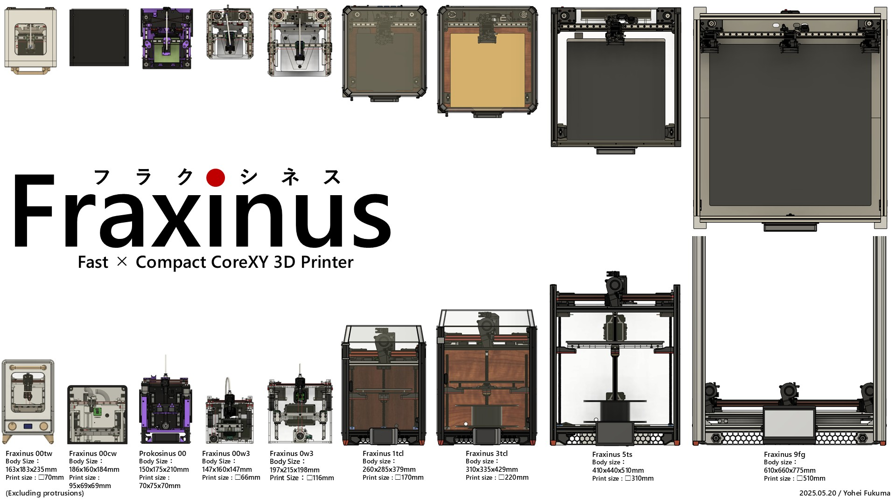

# Fraxinus

Fraxinus（フラクシネス）は印刷サイズと比較しコンパクトで高速動作を実現した3Dプリンタなどのデジタル加工機です。  
[エンクロージャ版](../docs/enclosure)や[トライデント版](../docs/trident)、[フライングガントリ版](../docs/flying-gantry)、[マイクロ3Dプリンタ](../docs/micro-printers)もあり、
さまざまな方々がハードウェア・ソフトウェアを学びながら様々な開発や改造をしています。  
興味を持って頂きましたらぜひ一緒にノウハウ共有して、同好の方々と楽しく交流できると嬉しいです！  
👉[Join Discord](https://fraxinus.jp/discord)

## Editing

編集方法については[DEVELOPMENT.md](./DEVELOPMENT.md)を参照してください。

## License

(C) 2022-2025 Fraxinus Project

`static/images`および`content`フォルダ内のファイルは[CC BY-NC-SA 4.0](https://github.com/Fraxinus-3D/docs/blob/main/LICENSE.md#CC-BY-NC-SA)（[日本語](https://creativecommons.org/licenses/by-nc-sa/4.0/legalcode.ja)）で公開されています。

その他のファイルは[MITライセンス](https://github.com/Fraxinus-3D/docs/blob/main/LICENSE.md#MIT)（[日本語](https://licenses.opensource.jp/MIT/MIT.html)）で公開されています。

## Acknowledgements

The following resources are included/used in the theme:

- [hugoplate](https://github.com/zeon-studio/hugoplate) by Zeon Studio - Licensed under the [MIT License](https://github.com/zeon-studio/hugoplate/blob/349436c8d33b26b0c0d261f3b0a15aedd66ae22c/LICENSE).
- [Feather](https://feather.netlify.com/) by Cole Bemis - Licensed under the [MIT License](https://github.com/colebemis/feather/blob/f81cd40fdcdd5e94f3f97eb670a5058e3aac528d/LICENSE).

See [THIRD-PARTY-NOTICES.md](./THIRD-PARTY-NOTICES.md) for other third party resources.
